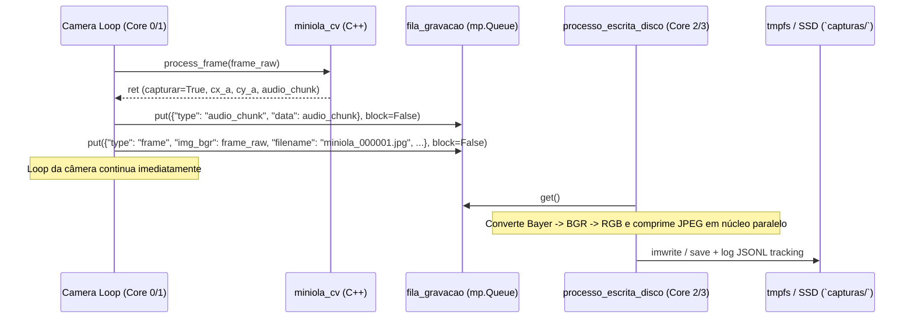

# SPEC-004: Pipeline de Gravação Assíncrona e RAM Drive (tmpfs)

| Metadado | Valor |
| :--- | :--- |
| **ID da Especificação** | `SPEC-004` |
| **Status** | `Completed` |
| **Autor** | Equipe Miniola |
| **Data de Criação** | 2026-07-19 |
| **Última Atualização** | 2026-07-19 |

---

## 1. Contexto e Objetivo
Capturar imagens de 1420x880 em 120 FPS no loop do sensor gera centenas de megabytes de dados brutos por segundo. Se o thread ou processo que lê o sensor tentar salvar cada quadro diretamente em disco ou fazer conversão de cor (Debayer) sincronicamente, haverá perda de quadros (`frame drop`) e engasgo no buffer USB. Além disso, em cartões MicroSD no Raspberry Pi, a escrita contínua em alta velocidade degrada a mídia e é excessivamente lenta.

Esta especificação define a arquitetura de gravação assíncrona em núcleo isolado (`multiprocessing.Process`) acoplada ao uso de armazenamento de latência ultra-baixa (`tmpfs` em RAM ou SSD NVMe).

## 2. Requisitos Funcionais
- `[RF-01]`: O sistema deve manter uma fila de comunicação multi-processo `fila_gravacao = mp.Queue(maxsize=30)` entre o loop de captura (`miniola.py`) e o processo de gravação em disco (`processo_escrita_disco`).
- `[RF-02]`: Quando o gatilho da perfuração disparar e `GRAVANDO == True`, o frame inteiro de overscan (`img_bgr`) e os metadados matemáticos de registro (`cx`, `cy`, `ox`, `oy`, `cw`, `ch`, `pitch_inst`) devem ser inseridos em `fila_gravacao` sem bloquear o loop de visão (`block=False`).
- `[RF-03]`: Se `fila_gravacao` estiver cheia (por saturação momentânea de I/O), o quadro excedente deve ser descartado com aviso de log (`[WARN] Fila de gravação cheia`), mas sem travar a captura da câmera.
- `[RF-04]`: O `processo_escrita_disco` deve rodar como um processo separado da CPU (desonerando o Core 0/1) e processar mensagens de gravação de imagens (`miniola_{n:06d}.jpg`), pedaços de áudio e telemetria de registro em arquivos `.jsonl` (`miniola_tracking_{session_id}.jsonl`).
- `[RF-05]`: Se a imagem for entregue em formato RAW8 Bayer de 1 canal (`len(shape) == 2`), o `processo_escrita_disco` deve executar o debayering assíncrono para BGR/RGB (`cv2.cvtColor(..., BAYER_MODE)`) antes de comprimir e salvar o JPEG de máxima qualidade (`subsampling=0`).

## 3. Requisitos Não-Funcionais e Performance
- `[RNF-01]`: A gravação assíncrona deve garantir que o tempo gasto pela função `processar_captura` no loop da câmera seja inferior a 0.5 ms.
- `[RNF-02]`: A compressão JPEG via `PILImage.fromarray(...).save(..., quality=99, subsampling=0)` (ou `cv2.imwrite`) no processo isolado deve atingir cadência suficiente para esvaziar a fila sem acumular lag permanente na sessão.

---

## 4. Matriz de Impacto Multi-Plataforma

| Plataforma | Comportamento Esperado / Restrições Específicas |
| :--- | :--- |
| **Raspberry Pi 5/4 (`arm64`)** | Requer obrigatoriamente a montagem do diretório de captura como RAM Drive em `/etc/fstab` (`tmpfs /home/felipe/miniola/capturas tmpfs defaults,noatime,size=1024M 0 0`). Devido ao limite de 1GB de RAM, as sessões de captura ao vivo devem ser processadas e limpas (`rout` / `r`) frequentemente. |
| **Mac Mini / MiniPCs (`x86_64`)** | Com 8GB a 16GB+ de RAM ou SSDs internos NVMe/SATA de alta velocidade (500 MB/s a 3500 MB/s), o limite de 1GB de `tmpfs` pode ser expandido ou flexibilizado, permitindo digitalizar rolos de filme maiores sem esgotar o buffer temporário. |

---

## 5. Arquitetura e Design Técnico

### 5.1. Componentes e Arquivos Modificados
- `miniola.py`: Definição de `fila_gravacao = mp.Queue(maxsize=30)` e `processo_escrita_disco`.
- `process.py`: Consome os arquivos `.jpg`, `.jsonl` e `.f32` salvos no diretório de captura.

### 5.2. Fluxo de Fila Multiprocessada

---

## 6. Critérios de Aceitação e Plano de Verificação

### 6.1. Verificação Automatizada (`tests/`)
- [x] O script de verificação (`check_specs.py`) valida o contrato de isolamento de processos e enfileiramento.
- [x] O teste unitário simulando `processo_escrita_disco` confirma que pacotes RAW de 1 canal são convertidos com o modo Bayer selecionado antes da gravação.

### 6.2. Verificação em Hardware / Operação
- [x] Ao disparar `rec` no painel de comando e rodar o filme no scanner, os quadros `miniola_00000X.jpg` e o log `miniola_tracking_{sid}.jsonl` são gravados em `capturas/` em tempo real sem causar quedas no FPS exibido na telemetria.
